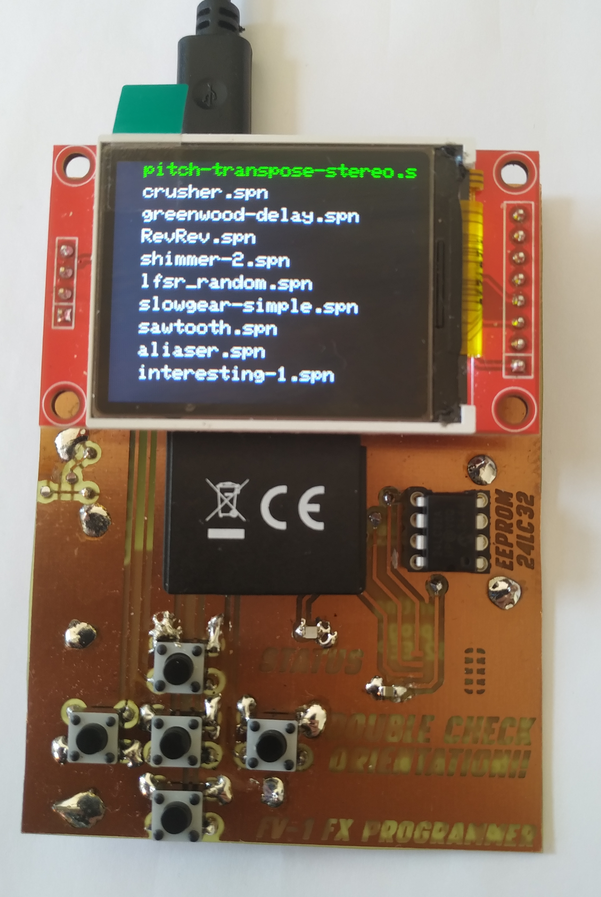
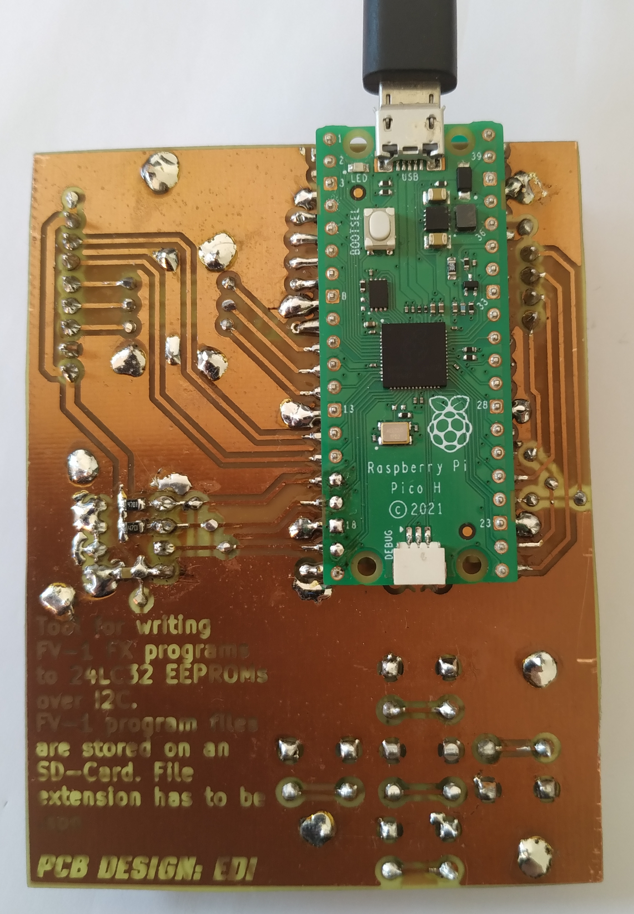

# Micropython FV-1 flasher

Small project for flashing 24LC32A EEPROMs using any microcontroller which has enough flash and
is able to run Micropython. Just because, a raspberry pico is used.

  
  

# Code

Huge thanks to ndf-zz for writing the asfv1 assembler. Without your work this would not be possible.
<https://github.com/ndf-zz/asfv1/>

As shlex is not in the standard Micropython library a copy of the source code is obtained and used
for running the asfv1 assembler. To get it running on the MCU one line is removed. So far this does
not seem to have an impact when running the code.

FV-1 programs are stored and read with a micro SD-card. All programs have to be in the root directory
and must have the `.spn` file extension to be found.

# Hardware

Everything is run by a Raspberry Pi Pico MCU.

User interface consists of:
- Display
- SD card slot
- EEPROM sockets
- Buttons

## Display

TFT display because it is cheaper than an OLED.
Has the SD card slot integrated.

## SD Card

Connected via SPI. Slot is Integrated into display module.

## EEPROM sockets

There are two positions on the PCB. One is for THT chips, the other for SMD chips.
SMD socket is the 

Make sure to insert the EEPROM with the correct orientation!!

## Buttons

In total there are five buttons arranged as a sort of D-Pad and a shift button.

Controls:
- up and down for scrolling through file list (faster scrolling when holding shift button)
- left and right for selecting program slot of selected file
- middle button
  * start programming (when not selecting slot)
  * selecting slot

# Obtain SPN files

Writing programs yourself for the FV-1 is good way to get some programs. Info on the assembly
language is a little harder to find than info on the FV-1 hardware. However there are some
sources inside a forum dating back to 2019:

- 
- 
- 

This is about all the info I could find on the assembly instructions itself...

Another wonderful source of programs is mstratman's collection of programs:

<https://mstratman.github.io/fv1-programs/>
